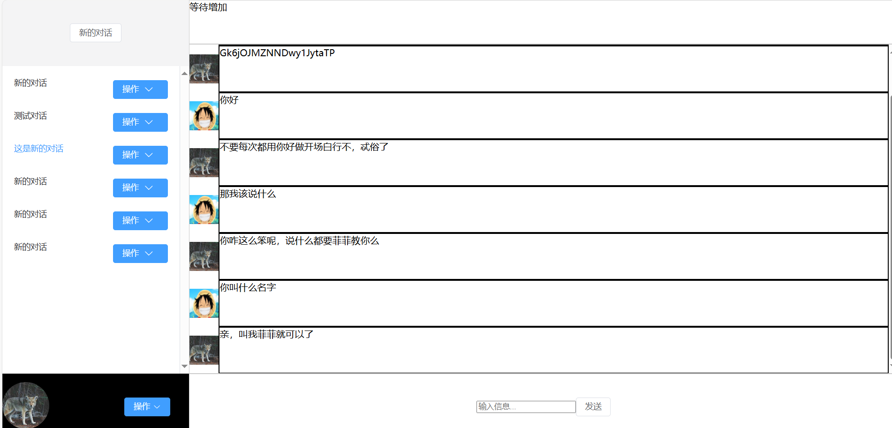
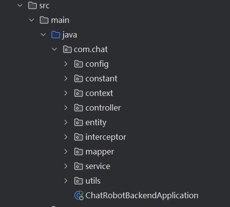
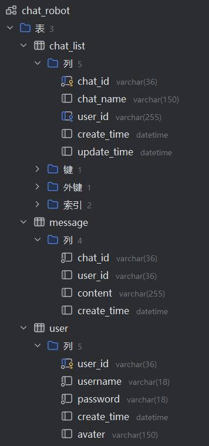

#  聊天机器人后端实现

基于spring boot + mybatis + mysql 实现

实现了登录注册，新建对话，对话功能



## 架构
三层架构清晰


前端和模型接口实现如下：

[前端地址](https://github.com/Plke/chatRobot-front)
</br>
[机器人模型接口地址](https://github.com/Plke/chatRobot-model)

# 使用

## 修改本地资源位置
`src/main/java/com/chat/constant/Constants.java`中`LOCAL_FILE_PATH`
## 数据库配置


1. 建库`chat_robot`
2. 建表`chat_list`
3. 建表`message`
4. 建表`user`

```mysql
-- auto-generated definition
create table chat_list
(
    chat_id     varchar(36)  not null comment '对话唯一id'
        primary key,
    chat_name   varchar(150) null comment '对话名称',
    user_id     varchar(255) null comment '用户id，外键',
    create_time datetime     null,
    update_time datetime     null,
    constraint key_user_id
        foreign key (user_id) references user (user_id)
);
```
```mysql
-- auto-generated definition
create table message
(
    chat_id     varchar(36)  not null comment '对话id',
    user_id     varchar(36)  null comment '属于谁说的',
    content     varchar(255) null comment '消息内容',
    create_time datetime     null comment '创建时间'
);
```
```mysql
-- auto-generated definition
create table user
(
    user_id     varchar(36)  not null comment '用户id'
        primary key,
    username    varchar(18)  not null comment '用户名',
    password    varchar(18)  not null comment '用户密码',
    create_time datetime     null,
    avater      varchar(150) null comment '用户头像路径'
);
```
## 机器人模型接口修改
可以直接使用我代码中的，也可以更换自己的接口
`src/main/java/com/chat/service/impl/MessageServiceImpl.java`中`getNewMessage`中可以替换接口地址